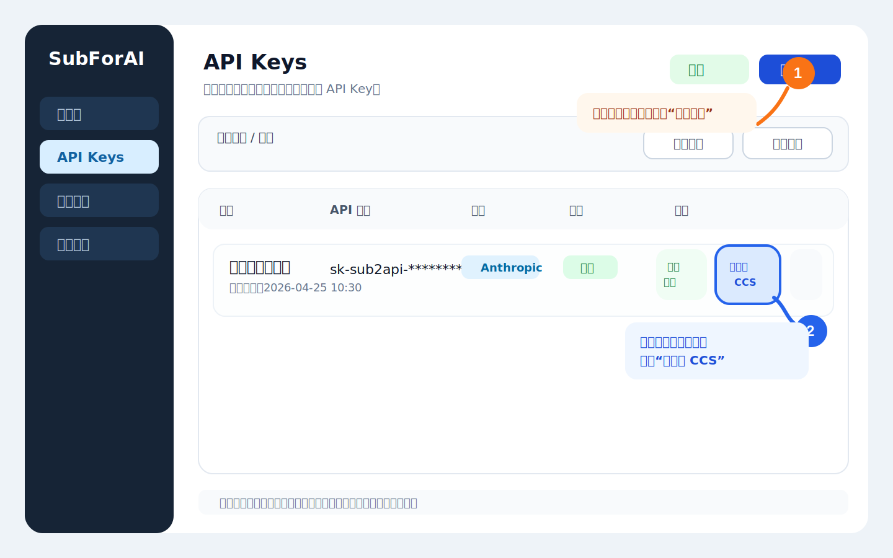
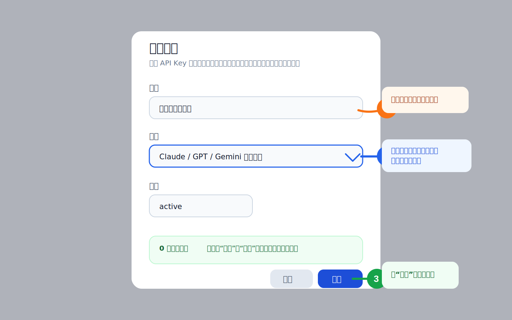
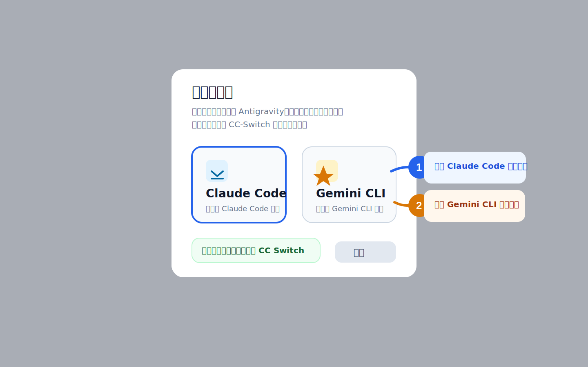

# Sub2API 导入到 CC Switch 教程

这篇教程面向 0 基础用户，按顺序照着点就可以。  
本文里的 `CC Switch`、`CC-Switch`、`CCS` 指的是同一个东西；在当前 Sub2API 界面里，按钮名称是 `导入到 CCS`。

> 说明：下面的截图是根据当前版本界面整理的示意截图，按钮名、弹窗名和操作顺序与项目实现一致，方便你对照操作。

## 先准备好这 3 样东西

- 你已经安装好了 `CC Switch`
- 你能正常登录你的 `Sub2API` 站点
- 你的账号下至少有 1 个可用的 API Key

如果你还没有 API Key，也没关系，下面教程里会一起讲。

## 整个流程其实只有 4 步

1. 登录 Sub2API，进入 `API Keys`
2. 没有密钥就先创建一个
3. 点击 `导入到 CCS`
4. 让浏览器唤起 `CC Switch` 完成导入

## 第 1 步：进入 API Keys 页面

登录 Sub2API 后，在左侧菜单找到 `API Keys`。  
如果你已经有可用密钥，直接在对应那一行点击 `导入到 CCS` 即可。

这里要注意两件事：

- 如果列表里还没有密钥，先点右上角 `创建密钥`
- 一定要点你自己要使用的那一行，不要点错别人的密钥

## 第 2 步：如果没有密钥，先创建一个

很多新用户第一次用时，页面里是空的。这时先创建密钥。

操作方法：

1. 点击右上角 `创建密钥`
2. `名称` 随便填，写成你自己能看懂的名字就行
3. `分组` 选择管理员给你开放的分组
4. 点击 `保存`

对 0 基础用户来说，第一次创建时通常只要管两项：

- `名称`
- `分组`

其他高级选项先保持默认，一般不会影响导入到 CC Switch。

## 第 3 步：点击“导入到 CCS”

回到 `API Keys` 列表后，找到你刚创建好的密钥，然后点击 `导入到 CCS`。

正常情况下，浏览器会立即尝试唤起 CC Switch。  
这一步你不需要手动复制一大堆配置，Sub2API 会把必要信息直接交给 CC Switch。

### 哪些信息会被自动带过去

Sub2API 会根据你的分组平台，自动决定导入到哪个客户端类型：

| 你的分组平台 | 导入到 CC Switch 后的目标类型 |
|---|---|
| `Anthropic` | `Claude` |
| `OpenAI` | `Codex` |
| `Gemini` | `Gemini CLI` |
| `Antigravity` | 需要你手动选 `Claude Code` 或 `Gemini CLI` |

## 第 4 步：如果弹出“选择客户端”，按你实际使用的工具选

只有部分分组会多这一步。  
如果你点击 `导入到 CCS` 后看到了 `选择客户端` 弹窗，说明这个密钥对应的是 `Antigravity` 平台。

怎么选：

- 你平时用 `Claude Code`，就选 `Claude Code`
- 你平时用 `Gemini CLI`，就选 `Gemini CLI`

选完后，浏览器会继续唤起 CC Switch。

## 导入完成后怎么确认成功

导入成功后，你通常会在 CC Switch 里看到新增的 provider / 配置项。  
最简单的确认方式有两个：

1. 看 CC Switch 里是否多出刚导入的配置
2. 用这个配置实际发一次请求，确认能正常连通

如果你看到了新配置，但请求失败，请先看下面的常见问题。

## 常见问题

### 1. 点击“导入到 CCS”后没有反应

大概率是这两种原因：

- 你的电脑没有安装 `CC Switch`
- `CC Switch` 的协议处理程序没有注册成功

Sub2API 当前的实现会调用类似 `ccswitch://...` 的唤起链接；如果系统不认识这个协议，就不会正常打开 CC Switch。

### 2. 页面里根本没有“导入到 CCS”按钮

这通常不是你点错了，而是站点管理员把这个按钮隐藏了。  
Sub2API 后台有一个开关叫 `隐藏 CCS 导入按钮`，打开后，用户侧就看不到这个按钮。

这时你需要联系管理员，不是你自己操作错了。

### 3. 导入了，但连不上

优先检查这几项：

- 这个 API Key 是否还是 `正常` 状态
- 这个 API Key 是否已经过期
- 这个 API Key 对应的分组是否真的有可用权限
- 站点管理员是否正确配置了 `API 端点地址`

补充说明：

- 如果管理员没有单独配置 `API 端点地址`，系统会默认使用当前站点地址
- 如果地址配错了，CC Switch 里导入进去的 endpoint 也会跟着错

### 4. 我不知道自己该选 Claude Code 还是 Gemini CLI

看你平时实际使用哪个客户端：

- 用 Claude Code，就选 `Claude Code`
- 用 Gemini CLI，就选 `Gemini CLI`

如果你压根不知道自己在用哪个，先别乱选，问一下给你账号的人。

## 最后给新手的最短版本

如果你只想记住最核心的操作，就记这一句：

> 登录 Sub2API -> 打开 `API Keys` -> 没有密钥就先创建 -> 点击 `导入到 CCS` -> 如果弹出客户端选择，就按你实际使用的客户端来选。

如果你准备把这篇教程发给完全不会的人，建议连同下面这句一起发：

> 如果页面里没有“导入到 CCS”按钮，或者点击后完全没反应，先不要反复重试，先确认是否已安装 CC Switch，再联系站点管理员。
